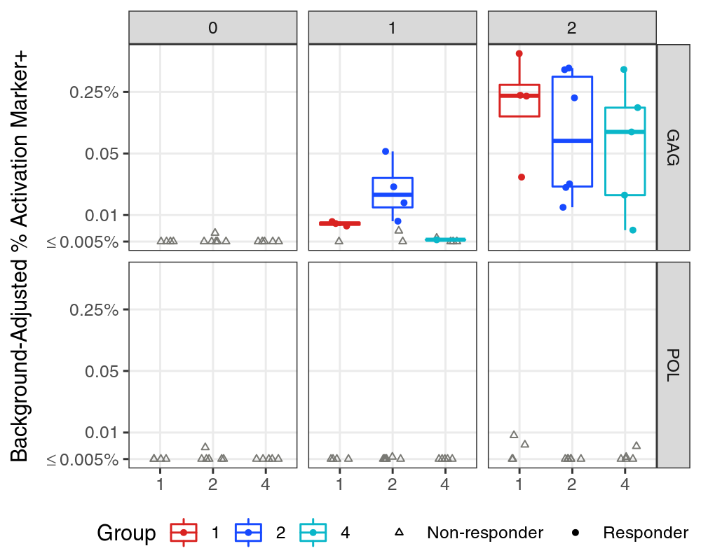

<!---
This section is required according to WI-0010.
Program Name:
Creation Date:
Full name of author:
Project or Protocol:
Purpose or description of program:
Location of program:
Location of input data:
--->

##### 

# Summary of Main Results

Summarize the main highlights from the Results section. 
This can be in bullet format. 
Any significant results mentioned should include p-values and references to 
appropriate figures and tables. 
There should be no information in the Summary section that is not contained in 
the Results section (see [Results](#results)).

# Background

<!-- The background section can be saved as a child R Markdown file in the docs/ folder so that the same text can be used across PT reports for the protocol. -->

<!-- background.md is generated from the RMARKDOWN file, background.Rmd. 
Please edit that file. -->

This document should contain the study background section for HVTNGitExample.

Write project background here. Don't use headers.

This report presents data [blinded/unblinded] to treatment arm, 
as of [enter date of data file creation].

Samples were collected at: 
[list study time points and corresponding relationship to vaccination, 
e.g., week 0 (1st vaccination), 
week 6 (2 weeks post-2nd vaccination), 
week 10 (2 weeks post-3rd vaccination, 
and week 26 (2 weeks post-4th (final) vaccination))] 
for [# groups; list vaccine doses or group descriptions] 
(reference test: @Huang:2013fl).

<!-- Frequently used citations are included in the `docs/bibliography.bib` file created with `VISCtemplates::create_visc_project()`. If `docs/bibliography.bib` doesn't exist, it will be created when you knit this document. -->

<!-- Also include the study schema here. -->

Table: Table 2.1: HVTNGitExample study schema.

Group      Sample Size  Week 10   Week 20 
--------  ------------  --------  --------
Group A             10  Dose A    Dose A  
Group B             10  Dose B    Dose B  

## Report Amendments 

If previous reports were provided, note if this report supplements or supersedes 
the previous reports. 
For example, "the previous PT report (distributed on DDMonthYYYY) presented 
peak data. This report summarizes additional durability data."

If this is an updated report, also briefly describe additional data included 
and/or analysis done since the previous report (e.g., additional visits, 
participants (include pubIDs), antigens, comparisons, new/changed tables, figures).

# Objectives

List primary and secondary (if applicable) objectives. 
Objectives can be found on ATLAS, in the study protocol, or in the SAP.

<!-- Use `VISCtemplates::use_visc_methods()` to create child Rmd files if needed. -->

# Biological Endpoints

<!-- background.md is generated from the RMARKDOWN file, background.Rmd.
Please edit that file. -->

<!-- this file was adapted from VISCtemplates 1.1.0. -->

Describe the lab measures of interest and the antigens/isolates tested. 
The biological endpoints may be in the SAP, or you may need to contact the lab 
for details. This may be done at the lab review stage.
Make sure to this section is written in the past tense.

# Lab Methods

<!-- background.md is generated from the RMARKDOWN file, background.Rmd.
Please edit that file. -->

<!-- this file was adapted from VISCtemplates 1.1.0. -->

Describe the lab methods. 
The lab methods section is written by the lab. 
Use template language prior to lab review, and then the lab can make changes to 
this section during their review.

# Statistical Methods

<!-- background.md is generated from the RMARKDOWN file, background.Rmd.
Please edit that file. -->

<!-- this file was adapted from VISCtemplates 1.1.0. -->

## Statistical Endpoints

Describe the statistical measures of interest (response, response magnitude, etc.) 
including response call methodology and truncation, if applicable.

## Graphical Analysis

Update the following section as appropriate for your data. 

Response rates were plotted, with accompanying Wilson score confidence intervals, 
for each group, antigen, and study time point. 
Distributions of response magnitude were plotted on the log scale for each 
group, antigen, and study time point with box plots superimposed on the 
distribution of responders. 
The mid-line of the box denotes the median and the ends of the box denote 
the $25^{th}$ and $75^{th}$ percentiles. 
The whiskers denote the most extreme data points that were no more than 1.5 
times the interquartile range (i.e., height of the box). 
To show response trend over time, line plots of response magnitude were plotted 
on the log scale by study group and antigen across time points.

## Statistical Tests

Update the following section as appropriate for your data. If available, use 
language from the statistical analysis plan. Ensure that this section includes 
all statistical methodology used in the report.

To assess if two groups have different response rates, pairwise group 
comparisons were conducted using Fisher’s exact test for each time point and 
antigen. 

For comparisons across time, McNemar's test were used to account for paired data. 
Response magnitude comparisons between experimental groups were compared using 
the Wilcoxon rank-sum test [among responders only]. 
Response magnitude comparisons between time points were performed using the 
Wilcoxon signed-rank test to account for paired data. 

# Participant Cohort

The study enrolled [describe the total number enrolled to date and, if unblinded, 
the number in each treatment arm]. 
Include a table with data availability by key variables and red highlights for 
counts that are less than expected. 
Refer to the table and comment on reasons for missing data if known.

# Results

The results section addresses how each endpoint supports the main objectives. 
Include summary statistics and significant results as applicable, 
including p-values and table and figure references. 
The results section should provide supporting evidence for all statements made 
in the summary section.

## Section 1

Consider breaking up the results section by objective or by statistical endpoint.

## Section 2

Make sure to include p-values and references to relevant tables and figures. 
See Figure <a href="#fig:example-plot">9.1</a> and Table <a href="#tab:example-tab">9.1</a>. 

##### 

# Figures and Tables

{width=100% }

##### 

Table: Table 9.1: Long caption to show above table. Explain everything needed to understand the table here.

Stim    Visit  Comparison   SampleSizes   Median (Range)                                    Mean (SD)                          MagnitudeTest 
-----  ------  -----------  ------------  ------------------------------------------------  ---------------------------------  --------------
GAG         0  1 > 2        4 vs. 6       0.000 [0.000, 0.002] vs. 0.000 [0.000, 0.006]     0.001 (0.001) vs. 0.001 (0.003)    0.667         
GAG         0  1 > 4        4 vs. 5       0.000 [0.000, 0.002] vs. 0.000 [0.000, 0.000]     0.001 (0.001) vs. 0.000 (0.000)    0.444         
GAG         0  2 > 4        6 vs. 5       0.000 [0.000, 0.006] vs. 0.000 [0.000, 0.000]     0.001 (0.003) vs. 0.000 (0.000)    0.273         
GAG         1  1 > 2        4 vs. 6       0.008 [0.004, 0.008] vs. 0.011 [0.003, 0.053]     0.007 (0.002) vs. 0.018 (0.018)    0.871         
GAG         1  1 > 4        4 vs. 5       0.008 [0.004, 0.008] vs. 0.002 [-0.005, 0.005]    0.007 (0.002) vs. 0.002 (0.004)    ***0.032***   
GAG         1  2 > 4        6 vs. 5       0.011 [0.003, 0.053] vs. 0.002 [-0.005, 0.005]    0.018 (0.018) vs. 0.002 (0.004)    ***0.009***   
GAG         2  1 > 2        4 vs. 6       0.226 [0.027, 0.683] vs. 0.119 [0.012, 0.466]     0.291 (0.278) vs. 0.197 (0.215)    0.176         
GAG         2  1 > 4        4 vs. 5       0.226 [0.027, 0.683] vs. 0.088 [0.007, 0.450]     0.291 (0.278) vs. 0.145 (0.182)    0.143         
GAG         2  2 > 4        6 vs. 5       0.119 [0.012, 0.466] vs. 0.088 [0.007, 0.450]     0.197 (0.215) vs. 0.145 (0.182)    0.331         
POL         0  1 > 2        4 vs. 6       0.000 [0.000, 0.003] vs. 0.000 [0.000, 0.007]     0.001 (0.002) vs. 0.001 (0.003)    0.667         
POL         0  1 > 4        4 vs. 5       0.000 [0.000, 0.003] vs. 0.000 [0.000, 0.003]     0.001 (0.002) vs. 0.001 (0.002)    0.722         
POL         0  2 > 4        6 vs. 5       0.000 [0.000, 0.007] vs. 0.000 [0.000, 0.003]     0.001 (0.003) vs. 0.001 (0.002)    0.697         
POL         1  1 > 2        4 vs. 6       0.002 [0.000, 0.005] vs. 0.000 [0.000, 0.005]     0.002 (0.002) vs. 0.001 (0.002)    0.452         
POL         1  1 > 4        4 vs. 5       0.002 [0.000, 0.005] vs. 0.000 [-0.005, 0.001]    0.002 (0.002) vs. -0.001 (0.002)   0.127         
POL         1  2 > 4        6 vs. 5       0.000 [0.000, 0.005] vs. 0.000 [-0.005, 0.001]    0.001 (0.002) vs. -0.001 (0.002)   0.132         
POL         2  1 > 2        4 vs. 6       0.004 [-0.001, 0.009] vs. 0.001 [-0.016, 0.004]   0.004 (0.005) vs. -0.001 (0.007)   0.381         
POL         2  1 > 4        4 vs. 5       0.004 [-0.001, 0.009] vs. 0.001 [-0.002, 0.007]   0.004 (0.005) vs. 0.002 (0.004)    0.365         
POL         2  2 > 4        6 vs. 5       0.001 [-0.016, 0.004] vs. 0.001 [-0.002, 0.007]   -0.001 (0.007) vs. 0.002 (0.004)   0.686         

#####  

Table: Table 9.2: Reproducibility software session information

name        value                                                        
----------  -------------------------------------------------------------
version     R version 4.0.4 (2021-02-15)                                 
os          openSUSE Leap 42.2                                           
system      x86_64, linux-gnu                                            
ui          X11                                                          
language    (EN)                                                         
collate     en_US.UTF-8                                                  
ctype       en_US.UTF-8                                                  
tz          America/Los_Angeles                                          
date        2022-10-25                                                   
pandoc      2.11.4 @ /usr/lib/rstudio-server/bin/pandoc/ (via rmarkdown) 
repo        https://github.com/pyu2101/HVTNGitExample.git                
file name   HVTN_Workshop_Example.Rmd                                    
location    HVTN_Workshop_Example                                        
user        Pei-Chun Yu                                                  

Table: Table 9.3: Reproducibility software package version information

package         version   date         source                                                                                          
--------------  --------  -----------  ------------------------------------------------------------------------------------------------
conflicted      1.1.0     2021-11-26   CRAN (R 4.0.4)                                                                                  
dplyr           1.0.9     2022-04-28   CRAN (R 4.0.4)                                                                                  
forcats         0.5.1     2021-01-27   CRAN (R 4.0.4)                                                                                  
ggplot2         3.3.6     2022-05-03   CRAN (R 4.0.4)                                                                                  
here            1.0.1     2020-12-13   CRAN (R 4.0.4)                                                                                  
kableExtra      1.3.4     2021-02-20   CRAN (R 4.0.4)                                                                                  
knitr           1.40      2022-08-24   CRAN (R 4.0.4)                                                                                  
purrr           0.3.4     2020-04-17   CRAN (R 4.0.4)                                                                                  
readr           2.1.2     2022-01-30   CRAN (R 4.0.4)                                                                                  
rmarkdown       2.16      2022-08-24   CRAN (R 4.0.4)                                                                                  
stringr         1.4.0     2019-02-10   CRAN (R 4.0.4)                                                                                  
tibble          3.1.7     2022-05-03   CRAN (R 4.0.4)                                                                                  
tidyr           1.2.0     2022-02-01   CRAN (R 4.0.4)                                                                                  
tidyverse       1.3.1     2021-04-15   CRAN (R 4.0.4)                                                                                  
VISCfunctions   1.2.2     2022-02-24   git2r (https://github.com/FredHutch/VISCfunctions.git@28be2826df1c09cf2cac919ae2db82e05dde8dd9) 
VISCtemplates   1.1.0     2022-10-19   Github (FredHutch/VISCtemplates@5c2da0e37c313fc59a3e01caa44777843b810c12)                       

##### 

# References
